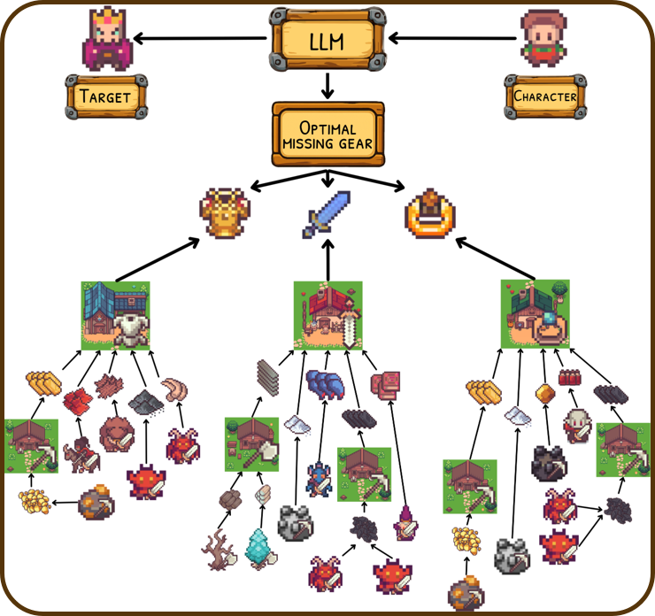

# HeroBench: A Benchmark for Long-Horizon Planning and Structured Reasoning in Virtual Worlds


[](https://www.python.org/downloads/)
[](https://fastapi.tiangolo.com/)
[](#license)
[](https://arxiv.org/abs/2508.12782)

HeroBench evaluates long-horizon planning and structured reasoning within an RPG-inspired virtual world based on [ArtifactsMMO](https://www.artifactsmmo.com/). It couples a simulated environment with a carefully crafted task dataset and analysis tools to assess LLMs on strategic long-horizon planning, resource managment, and math.

<p align="center">
  
  
</p>

<p align="center">
  <em>Figure 1. A snippet of the virtual environment in HeroBench (left). Example of task from HeroBench (right).</em>
</p>

We evaluated 25 state-of-the-art large language models (LLMs) on **HeroBench**.  


| Model                | Success % | Score (mean ± SD) | Tokens (mean ± SD) |
|-----------------------|-----------|-------------------|---------------------|
| Qwen3 8b             | 0.0       | 11.5 ± 6.8        | 2883 ± 1965         |
| Qwen3 32b            | 1.7       | 21.9 ± 12.8       | 2074 ± 1222         |
| GigaChat 2 Max       | 2.8       | 21.3 ± 15.4       | 1190 ± 228          |
| Qwen3 8b (t)         | 3.9       | 28.8 ± 15.5       | 9680 ± 1224         |
| Deepseek-v3          | 7.2       | 32.7 ± 17.9       | 1586 ± 430          |
| Kimi-K2              | 8.3       | 29.6 ± 16.4       | 1309 ± 237          |
| GPT-oss-120b         | 8.9       | 27.0 ± 8.7        | 9372 ± 2959         |
| Magistral-medium     | 9.4       | 25.0 ± 18.8       | 10885 ± 1667        |
| Qwen3 32b (t)        | 10.0      | 44.8 ± 17.1       | 9107 ± 1458         |
| DeepSeek-R1-70B      | 11.2      | 27.5 ± 21.2       | 7448 ± 1029         |
| Qwen3-235b           | 13.3      | 34.9 ± 20.5       | 12006 ± 1746        |
| GPT-4.1-mini         | 16.1      | 53.9 ± 17.6       | 4555 ± 1398         |
| Claude-Sonnet-4      | 17.2      | 50.6 ± 21.0       | 1578 ± 306          |
| Qwen3-235b-2507      | 24.4      | 49.4 ± 18.6       | 11387 ± 2702        |
| Deepseek-R1-0528     | 21.7      | 48.7 ± 22.5       | 10711 ± 2088        |
| Gemini-2.5-flash     | 26.1      | 64.8 ± 13.7       | 11028 ± 4010        |
| GPT-4.1              | 31.7      | 73.7 ± 10.3       | 3518 ± 1202         |
| o4-mini              | 35.0      | 56.1 ± 23.5       | 21993 ± 8181        |
| GPT-5-mini           | 35.0      | 59.8 ± 22.5       | 14126 ± 4169        |
| Claude-Sonnet-4 (t)  | 44.4      | 73.8 ± 16.9       | 16397 ± 4313        |
| o3                   | 60.6      | 84.6 ± 8.5        | 13897 ± 5250        |
| Gemini-2.5-pro       | 62.9      | 86.6 ± 10.4       | 12935 ± 4295        |
| GPT-5                | 83.9      | 95.0 ± 3.3        | 17851 ± 7149        |
| Grok-4               | 91.7      | 95.3 ± 3.3        | 15470 ± 5838        |

*Table: Mean performance of all evaluated models across nine base task difficulty levels in HeroBench.  
Columns show success rate (%), score (mean ± SD), and tokens (mean ± SD). SD is computed across the nine difficulty-level averages for each model. Thinking-enabled variants are denoted by (t).*


| Model            | Base Succ (%) | Base Score (±SD) | Base Tokens (±SD) | Leveling Succ (%) | Leveling Score (±SD) | Leveling Tokens (±SD) | L+Noise Succ (%) | L+Noise Score (±SD) | L+Noise Tokens (±SD) |
|------------------|---------------|------------------|-------------------|-------------------|-----------------------|-----------------------|------------------|----------------------|-----------------------|
| o3               | 5             | 66.2 ± 32.1      | 20688 ± 2791      | 0                 | 26.6 ± 28.4           | 22606 ± 2788          | 0                | 15.9 ± 12.0          | 23562 ± 3996          |
| Claude-Sonnet-4  | 10            | 42.6 ± 36.3      | 21366 ± 6036      | 0                 | 25.6 ± 19.0           | 24588 ± 6651          | 0                | 21.9 ± 14.2          | 25404 ± 5697          |
| Gemini-2.5-pro   | 25            | 66.1 ± 26.6      | 18636 ± 3835      | 10                | 32.7 ± 26.4           | 20047 ± 3141          | 5                | 36.0 ± 28.5          | 21741 ± 3127          |
| GPT-5            | 55            | 90.6 ± 16.5      | 28052 ± 3776      | 15                | 62.3 ± 32.6           | 31704 ± 3656          | 20               | 59.9 ± 34.2          | 36052 ± 4196          |
| Grok-4           | 80            | 95.5 ± 14.2      | 22850 ± 4587      | 65                | 92.9 ± 16.5           | 28361 ± 5953          | 65               | 78.8 ± 31.8          | 33305 ± 6672          |


*Table: Evaluation of five leading reasoning models under increased task complexity.  
Results are shown for three conditions: **Base** (standard level 9 tasks), **Leveling** (requires skill progression before crafting), and **Leveling+Noise** (adds adversarial distractor items). Metrics include success rate, progress score (mean ± SD), and token usage (mean ± SD).*

For further details, please refer to our [paper](https://arxiv.org/abs/2508.12782).
## Table of Contents

- [Environment Features](#features)
- [Getting Started](#getting-started)
  - [Prerequisites](#prerequisites)
  - [Installation](#installation)
  - [Running the Environment](#running-the-environment)
- [LLM Evaluation](#llm-evaluation)
- [Analysis & Visualisation](#analysis--visualisation)
- [API Overview](#api-overview)
- [Contributing](#contributing)
- [License](#license)
- [Citation](#citation)

## Environment Features

HeroBench is built on a structured RPG-style grid world with the following features:

- **World layout**: 70 locations with resource nodes, workshops, and monster spawns.  
- **Content**: 25 unique monsters, 17 resource types, and 208 craftable items (gear + components).  
- **Task types**:  
  - *Crafting* — gather resources and produce items.  
  - *Combat* — defeat monsters, often requiring crafted gear.  
- **Mechanics**:  
  - Turn-based combat with four elemental damage types, resistances, and amplifications.  
  - Directed crafting chains with multi-step dependencies.  
- **Difficulty extensions**:  
  - *Leveling*: agents must progress profession skills (e.g., mining, crafting) from level 1.  
  - *Noise items*: distractor gear that appears valid but is impossible to craft.  
- **Representation**: All environment data and tasks are defined in structured JSON, ensuring reproducibility.  

## Getting Started

### Prerequisites
- Python 3.8 or higher (Python 3.12.4 recommended)
- Redis (optional, for performance)

### Installation

```bash
git clone https://github.com/stefanrer/HeroBench
cd HeroBench
```

Install dependencies for the environment server:

```bash
pip install -r requirements.txt
```

#### Install Redis
- Ubuntu/Debian
   ````bash
   sudo apt-get install lsb-release curl gpg
   curl -fsSL https://packages.redis.io/gpg | sudo gpg --dearmor -o /usr/share/keyrings/redis-archive-keyring.gpg
   sudo chmod 644 /usr/share/keyrings/redis-archive-keyring.gpg
   echo "deb [signed-by=/usr/share/keyrings/redis-archive-keyring.gpg] https://packages.redis.io/deb $(lsb_release -cs) main" | sudo tee /etc/apt/sources.list.d/redis.list
   sudo apt-get update
   sudo apt-get install redis
   ````
   Redis will start automatically, and it should restart at boot time. If Redis doesn't start across reboots, you may need to manually enable it:
   ````bash
   sudo systemctl enable redis-server
   sudo systemctl start redis-server
   ````
- macOS
   ````bash
   brew install redis
   ````
  To test your Redis installation, you can run the redis-server executable from the command line:
   ````bash
   redis-server
   ````
  
- Windows

  https://redis.io/docs/latest/operate/oss_and_stack/install/archive/install-redis/install-redis-on-windows/


### Running the Environment

Start the environment using Redis (recommended):

```bash
cd Virtual_Environment/FastApi_Redis_Ver
fastapi run
```

To run the SQLite version:

```bash
cd Virtual_Environment/FastApi_SQLite_Ver
fastapi run
```
## Datasets

The datasets are split into two files:  
- **prompts.json** – contains ready-to-use prompts for LLMs.  
- **tasks.json** – contains structured task descriptions.  

The repository provides an original dataset of **844 tasks** (`dataset_large`) and a smaller dataset that is a subset of the large one, used for experiments in our paper. The smaller dataset includes **9 difficulty levels with 20 tasks each**.  

In addition, there are extended versions of the dataset that incorporate **leveling mechanics** and **noisy items**.  

You can also generate custom datasets:  
- Use `datasets/dataset_create` to sample different tasks from `dataset_large`.  
- Use `increase_difficulty_scripts/add_leveling.py` and `increase_difficulty_scripts/add_noise.py` to add extra complexity mechanics to a dataset.  

## LLM Evaluation

Use `scoring_pipeline.py` to evaluate models. The `LLMService` supports:

- OpenAI API
- OpenRouter API
- Ollama
- HuggingFace (local models)

Configure the task and prompt file paths. Running the script produces three files in the output directory:

1. `<name>.json` – main results
2. `<name>_full_log.json` – full model responses
3. `<name>_code_logs.json` – extracted code and environment logs

## Analysis & Visualisation

Visualise results with:

- `visualisation_scripts/table_mean.py`
- `visualisation_scripts/plot_figures.py`

Outputs are saved to `results/plots_tables`.

For error analysis run `statistics_pipeline.py` on `<name>_code_logs.json` or results/your_results folder to produce:

1. `<name>_scores.json` – failure analysis per task
2. `<name>_stats.json` – mean analysis by difficulty

Generate statistics tables using `visualisation_scripts/table_statistics.py`.

## Contributing

Contributions are welcome!

1. Fork the repository
2. Create a feature branch: `git checkout -b feature/your-feature-name`
3. Make your changes
4. Run tests (if available)
5. Submit a pull request

Ideas for contribution include new task types, environment features, evaluation metrics, and improved documentation.

## License

HeroBench is licensed under the MIT License.

## Citation

If you use HeroBench in your research, please cite:

```bibtex
@misc{anokhin2025herobenchbenchmarklonghorizonplanning,
      title={HeroBench: A Benchmark for Long-Horizon Planning and Structured Reasoning in Virtual Worlds}, 
      author={Petr Anokhin and Roman Khalikov and Stefan Rebrikov and Viktor Volkov and Artyom Sorokin and Vincent Bissonnette},
      year={2025},
      eprint={2508.12782},
      archivePrefix={arXiv},
      primaryClass={cs.AI},
      url={https://arxiv.org/abs/2508.12782}, 
}
```

For questions or issues, open an issue on GitHub or contact the maintainers.

